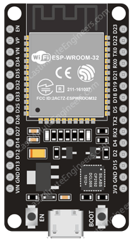
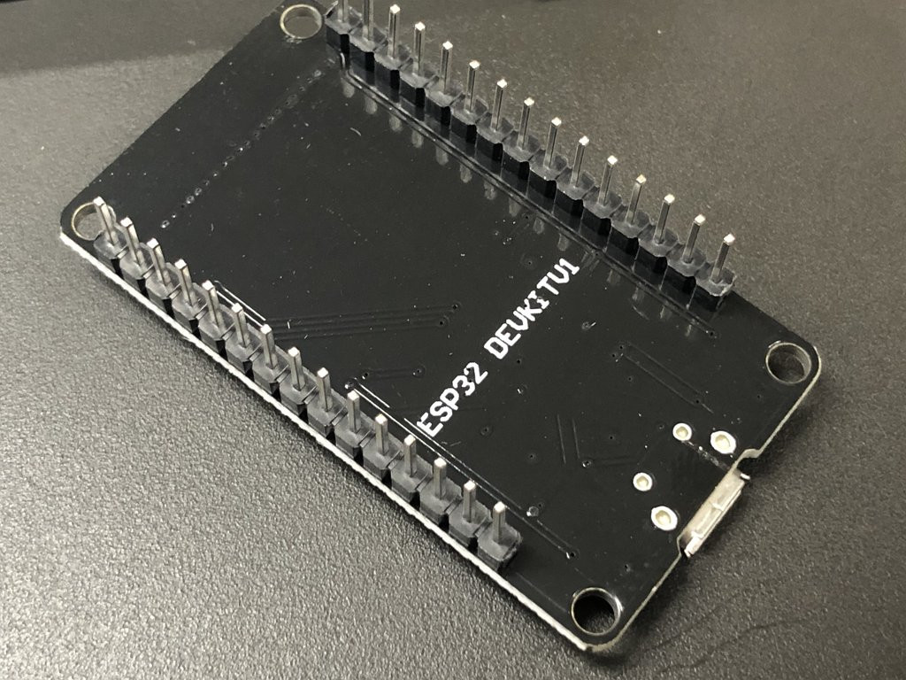

# ESP32-DEVKIT-V1

알리 또는 디바이스 판매하는 곳에서 쉽게 구할수 있는 제품이다. ESP32 Basic Starter Kit 에도 포함되어 있는 제품이다.

 

많이 올라와 있지만 ESP32 에서 만든 DevKit은 아닌것 같고 [Doit.am](https://doit.am) 에서 제작해 판매한 것이 복제되어 현재 판매 되는 것으로 보임.

회로도는 검색을 해봐도 명확하게 찾을수는 없었다.

[Overview of the ESP32 DevKit DOIT V1](https://embedded-systems-design.github.io/overview-of-the-esp32-devkit-doit-v1/) 에 올라와 있는 [pdf 자료](schematic/SchematicsforESP32.pdf)를 다운로드 및 링크해 놓았다.