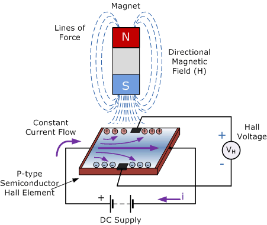
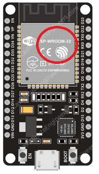

# 설명

ESP32 는 내부에 홀센서를 내장해서 제공하고 있다. 

홀 효과 센서는 자기장에 반응하여 출력 전압을 변화시키는 변환기다. 홀 효과 센서는 근접 감지, 위치 확인, 속도 감지 및 전류 감지 애플리케이션에 사용된다.

이 소스 코드는 **File** --> **Example** --> **ESP32** --> **HallSensor** 예제다. 

이 코드를 실행하면 숫자값이 기본적으로 20 정도 나오지만 ESP32 모듈에 자석을 가까이 가지고 가면 자석이 극성 방향에 따라서 -200 ~ +120 전후로 변화하는 것을 볼수 있다.

HallSensor의 위치는 아래 그림에서 빨간색 부분이 표시되어 있는 위치에 있는 것으로 보이며 여기에 자석을 가지고 가면 값이 변하는 것을 확인 할수 있다.

## 참고 
아래 사이트에서 Hall 센서 관련 내용 및 이미지를 가지고 왔다.
* [ESP32 Internal Hall Sensor Example](https://circuits4you.com/2019/01/01/esp32-internal-hall-sensor-example/)
  
