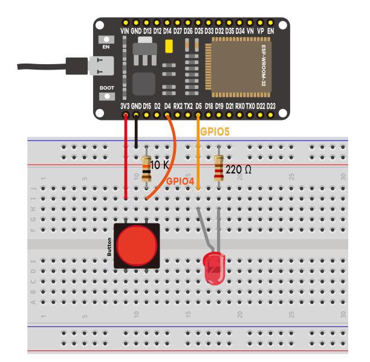
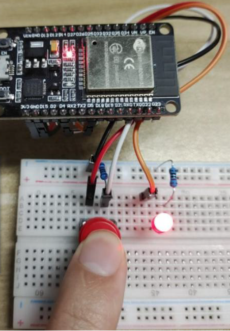

# 설명

이 예제는 GPIO 핀을 이용하여 입력과 출력을 보여주는 예제이다.

이 예제를 통해서 다음 3가지를 공부 할수 있다.

1. push 버튼에 10K 옴을 연결하는 이유( 풀다운)
2. LED에 220 옴을 연결하는 이유(전원 분배)
3. GPIO 처리 방법

회로 구성은 아래 그림과 같다.

D4 에 푸시 버튼을 연결하고 D5에 적색 LED를 연결하였다. 코드를 업로드하고 동작시키면 Push 버튼을 누르면 적색 LED가 켜지고 Push 버튼을 놓으면 적색 LED가 꺼진다.

