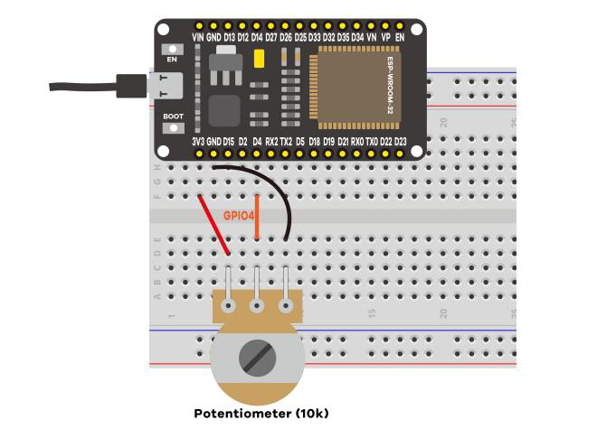
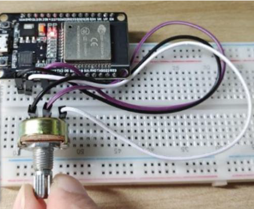
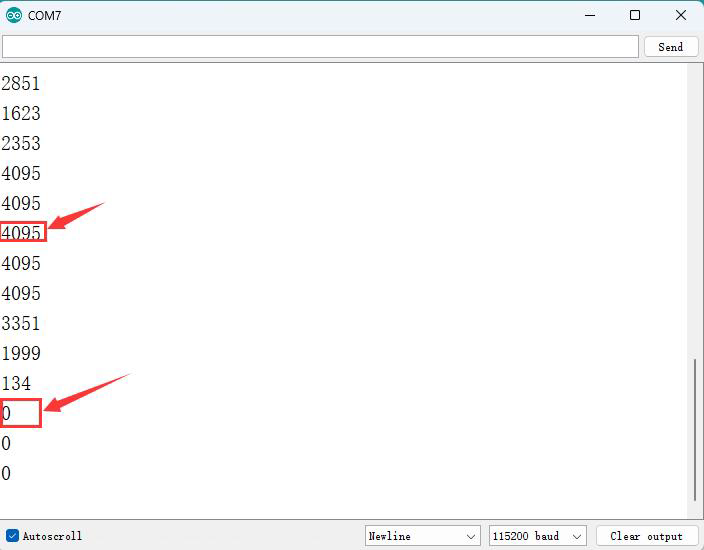

# 설명

이 예제는 GPIO 핀을 이용하여 아날로그 데이터를 읽는 방법을 보여주는 예제이다.

이 예제를 통해서 다음 3가지를 공부 할수 있다.

1. 가변저항을 사용하는 방법
2. ADC 값이 어떻게 나오는지.

회로 구성은 아래 그림과 같다.

D4 가변 저항의 가운데 핀을 연결한다. 3v3 과 GND는 방향이 바뀌어도 상관이 없다. 

결과는 시리얼 모니터를 통해 다음과 같이 나온다.

결과를 확인해 보면 0 ~ 3v3 까지 정확하게 나누어서 값이 나오는것이 아니라 0 ~ 0.1v  , 3.2 ~ 3.3v 사이의 값은 동일한 값을 준다.